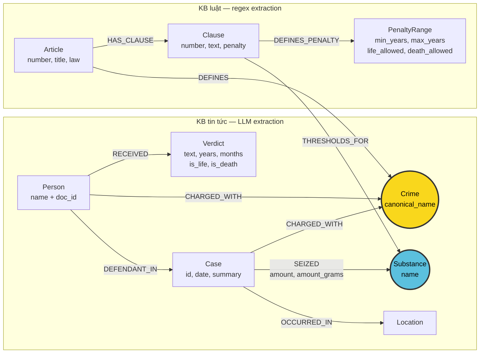

# Thiết kế Ontology — Day 19

**Họ tên:** Nguyễn Minh Thắng  **MSSV:** 2A202602706

**Lựa chọn:**

- [ ] Dùng ontology gợi ý (có thể chỉnh nhỏ)
- [x] Tự thiết kế — person-level, hai cầu nối `Crime` và `Substance`

## 1. Sơ đồ

`Crime` và `Substance` là hai node cầu nối dùng chung giữa hai KB. Liên kết tội danh được đặt trực tiếp ở cấp `Person`; liên kết `Case → Crime` vẫn được giữ làm thông tin tổng quát và fallback khi bài báo không nêu rõ tội của từng người.

## 2. Entity types (node labels)

| Label | Ý nghĩa | Khóa định danh (`MERGE` theo) | Properties chính | KB | Trích bằng |
| --- | --- | --- | --- | --- | --- |
| `Person` | Người xuất hiện trong một bài/vụ án | `(name, doc_id)` | `name`, `aliases`, `doc_id` | Tin | LLM + chuẩn hóa |
| `Case` | Một vụ việc trong một bài báo | `id = doc_id#case-n` | `name`, `summary`, `date`, `source_title`, `doc_id` | Tin | LLM |
| `Verdict` | Mức án riêng của một người | `id = case_id\|person_name` | `text`, `years`, `months`, `is_life`, `is_death`, `doc_id` | Tin | LLM + regex hậu xử lý |
| `Location` | Địa điểm vụ việc | `name` | `name` | Tin | LLM |
| `Crime` | Tội danh chuẩn hóa | `canonical_name` | `name`, `canonical_name` | Dùng chung | Regex luật + hybrid linking tin |
| `Substance` | Chất ma túy chuẩn hóa | `name` | `name` | Dùng chung | Regex/dictionary + LLM |
| `Article` | Điều luật | `id` | `number`, `title`, `law`, `doc_id` | Luật | Regex |
| `Clause` | Khoản của Điều luật | `id` | `number`, `clause_number`, `text`, `penalty`, `doc_id` | Luật | Regex theo khối |
| `PenaltyRange` | Khung hình phạt có thể lọc số học | `id` (cùng id Khoản) | `text`, `min_years`, `max_years`, `life_allowed`, `death_allowed`, `doc_id` | Luật | Regex |

Các node sinh riêng từ một tài liệu (`Article`, `Clause`, `PenaltyRange`, `Case`, `Person`, `Verdict`) đều mang `doc_id`. `Crime`, `Substance`, `Location` là node dùng chung nên không gắn một `doc_id` đơn lẻ.

## 3. Relationships

| Type | Từ → Đến | Properties trên cạnh | Ý nghĩa |
| --- | --- | --- | --- |
| `DEFENDANT_IN` | `Person → Case` | `role` | Người tham gia vụ án với vai trò nào |
| `CHARGED_WITH` | `Person → Crime` | — | Tội danh riêng của đúng người đó |
| `RECEIVED` | `Person → Verdict` | — | Mức án riêng của người đó |
| `CHARGED_WITH` | `Case → Crime` | — | Tội danh tổng quát của vụ, dùng fallback |
| `SEIZED` | `Case → Substance` | `amount`, `amount_grams` | Chất và lượng thu giữ/truy cứu trong vụ |
| `OCCURRED_IN` | `Case → Location` | — | Địa điểm vụ việc |
| `DEFINES` | `Article → Crime` | — | Điều luật quy định tội danh |
| `HAS_CLAUSE` | `Article → Clause` | — | Điều luật chứa Khoản |
| `DEFINES_PENALTY` | `Clause → PenaltyRange` | — | Khung hình phạt của Khoản |
| `THRESHOLDS_FOR` | `Clause → Substance` | — | Khoản có ngưỡng định lượng cho chất đó |

## 4. Node cầu nối giữa 2 KB

- **Cầu chính — `Crime`:** từ người/vụ án trong tin đi thẳng sang tội danh, rồi sang Điều và Khoản trong BLHS. Cấp `Person` tránh lỗi một vụ có nhiều bị cáo nhưng mỗi người bị xử lý về tội khác nhau.
- **Cầu thứ hai — `Substance`:** từ tang vật và `amount_grams` trong tin đi sang các Khoản có ngưỡng của cùng chất. Cầu này cho phép Q5 chọn đúng Khoản 4 thay vì chỉ trả Khoản 1.
- **Đảm bảo khớp tên:** `link_entity` thực hiện theo thứ tự exact sau chuẩn hóa → dictionary alias chuyên ngành → fuzzy `cutoff=0.8`. Tội danh được đối chiếu với danh sách lấy từ tiêu đề các Điều BLHS. Chất được đối chiếu với danh sách chuẩn; ví dụ `thuốc lắc → MDMA`, `ma túy đá → Methamphetamine`.
- **Khi cầu gãy:** JSON sai hoặc tội/chất không map được sẽ không tạo liên kết phỏng đoán. `extract_news_cases` bắt lỗi JSON và kiểm tra kiểu dữ liệu; `context()` có tầng fallback theo tên/biệt danh người trong câu hỏi nếu vector search trả sai `doc_id`.

## 5. Competency questions

| Câu | Đường đi chính trên graph | Trả lời được? |
| --- | --- | --- |
| Q1 | `(:Article {law:'Luật PCMT', number:2})-[:HAS_CLAUSE]->(:Clause {number:4})` | Có; vector `doc_id` chọn Điều 2, overlap từ khóa chọn định nghĩa “Tiền chất”. |
| Q2 | `(:Person)-[:DEFENDANT_IN]->(:Case)<-[:DEFENDANT_IN]-(:Person)` kết hợp `(:Person)-[:RECEIVED]->(:Verdict {is_death:true})` | Có; lọc đúng từng bị cáo nhận án tử hình. |
| Q3 | `(:Person {name:'Lê Minh Thành'})-[:CHARGED_WITH]->(:Crime)<-[:DEFINES]-(:Article)-[:HAS_CLAUSE]->(:Clause {number:1})` và `Person-[:RECEIVED]->Verdict` | Có; nối 36 tháng tù với Điều 251, Khoản 1. |
| Q4 | `(:Person {aliases:['Hoàng Nato']})-[:CHARGED_WITH]->(:Crime)<-[:DEFINES]-(:Article)-[:HAS_CLAUSE]->(:Clause)-[:DEFINES_PENALTY]->(:PenaltyRange)` | Có; intent “tối đa/cao nhất” chọn Khoản có hình phạt chính cao nhất. |
| Q5 | `Person-[:DEFENDANT_IN]->Case-[:SEIZED {amount_grams}]->Substance<-[:THRESHOLDS_FOR]-Clause<-[:HAS_CLAUSE]-Article-[:DEFINES]->Crime<-[:CHARGED_WITH]-Person` | Có; 9.600g MDMA khớp ngưỡng từ 100g trở lên ở Khoản 4 Điều 250. |
| Q6 | `(:Substance {name:'MDMA'})<-[:SEIZED]-(:Case)<-[:DEFENDANT_IN]-(:Person)` | Có; entity seed `MDMA` gom các vụ từ nhiều bài, không phụ thuộc một `doc_id`. |

## 6. Quyết định thiết kế và đánh đổi

1. **Tội danh ở cấp người.** Phương án gợi ý chỉ đặt `Case → Crime`, ngắn hơn nhưng có thể gán nhầm mọi tội của vụ cho mọi bị cáo. Thiết kế hiện tại đặt `Person → Crime` và giữ cạnh cấp vụ làm fallback; graph có thêm cạnh nhưng ngữ nghĩa chính xác hơn.
2. **Verdict là node riêng.** Đặt mức án trên cạnh `Person → Case` đơn giản hơn. Node `Verdict` tốn thêm node/cạnh nhưng cho phép lọc `is_death`, `is_life`, `years`, `months` bằng Cypher và không trộn mức án giữa người.
3. **Hai cầu nối thay vì một.** Chỉ dùng `Crime` đủ cho Q3/Q4 nhưng không chọn được Khoản theo định lượng ở Q5. `Substance` + `amount_grams` giải quyết truy vấn ngưỡng, đổi lại cần chuẩn hóa đơn vị và alias chất.
4. **Regex cho luật, LLM cho tin.** Luật có cấu trúc ổn định nên regex rẻ, lặp lại được; tin là văn xuôi nên cần LLM. JSON từ LLM được validate, canonicalize lại trong Python trước khi ghi graph.
5. **Context thích ứng.** Mặc định chỉ đưa Khoản 1; câu hỏi “cao nhất” lấy Khoản hình phạt cao nhất; câu hỏi có chất và khối lượng chỉ lấy Khoản có ngưỡng phù hợp. Cách này giảm token nhưng phụ thuộc regex định lượng hiện hỗ trợ `g/gam` và `kg/kilôgam`.

## 7. So với ontology gợi ý

| Điểm khác | Ontology gợi ý | Thiết kế này | Vấn đề giải quyết | Bằng chứng |
| --- | --- | --- | --- | --- |
| Tội danh cá nhân | `Case → Crime` | `Person → Crime` + fallback cấp vụ | Không đánh đồng tội giữa các bị cáo | Cypher integration nối riêng Lê Minh Thành → mua bán → Điều 251. |
| Mức án | Property trên cạnh tham gia | Node `Verdict` có trường số/boolean | Lọc tử hình/chung thân, giữ đúng án từng người | Neo4j tạo `Person-[:RECEIVED]->Verdict`; Q2 dùng `is_death`. |
| Định lượng chất | Chỉ `Clause → Substance` dạng nhắc đến | `SEIZED.amount_grams` + `THRESHOLDS_FOR` | Chọn Khoản theo lượng ma túy | Kiểm thử Neo4j với 9,6kg MDMA trả đúng Khoản 4 Điều 250. |
| Khóa Person | `name` toàn cục | `(name, doc_id)` | Tránh vô tình nhập hai người cùng tên ở hai bài | Composite uniqueness constraint trên Neo4j. |
| Retrieval | Chỉ theo `doc_id` | `doc_id` + fallback entity/alias | Vector search trượt vẫn có graph facts | Truyền `wrong-doc-id` cho câu Cái Quang Huy vẫn tìm Điều 250, Khoản 4. |

## 8. Hạn chế còn lại

- Hai bài báo nói về cùng một người hiện tạo hai `Person` khác nhau vì khóa có `doc_id`; muốn hợp nhất cần thêm định danh tin cậy hoặc node `Identity` riêng.
- Regex định lượng chưa xử lý mọi cách viết như miligam, thể tích, tổng nhiều chất tương đương hay số viết bằng chữ.
- LLM có thể bỏ sót người/tội/chất. Validation ngăn graph hỏng hoặc nối bừa nhưng không thể tự khôi phục thông tin bị bỏ sót.
- Tên vụ và địa điểm vẫn phụ thuộc extraction; `Location` chưa có chuẩn hóa địa giới hành chính.
- Aggregation hiện tối ưu recall nhưng chưa có bước hợp nhất sự kiện xuyên bài; benchmark Q6 đạt recall 1,00 nhưng vẫn xuất hiện một Case Cái Quang Huy bị trích lặp từ phần teaser của bài khác.
